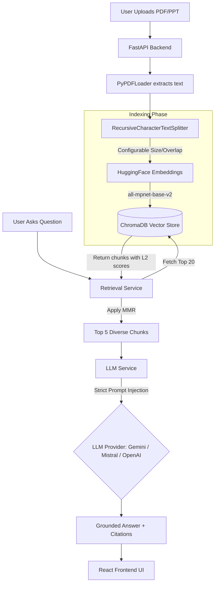

# CourseMate AI 🎓🤖

CourseMate AI is a production-grade **Retrieval-Augmented Generation (RAG)** application designed to help students and professionals interactively chat with their course materials, presentations (PPTs), and PDFs. 

Built with a **FastAPI** backend and a **React + Tailwind CSS** frontend, the system relies strictly on uploaded documents to answer questions, entirely preventing LLM hallucinations.

---

## 🌟 Key Features
- **Strict Grounding:** The AI is strictly prompt-engineered and architecture-bound to *only* answer using the uploaded context. If the answer isn't there, it will tell you!
- **Configurable Chunking:** Customize the `chunk_size` and `chunk_overlap` directly from the UI before indexing to optimize for different document structures.
- **Preview Chunks:** Visually inspect how your document is split before committing to the expensive embedding and indexing process.
- **MMR Retrieval:** Uses Maximal Marginal Relevance (MMR) to retrieve diverse but highly relevant context for the LLM.
- **Multi-Provider LLM Support:** Seamlessly switch between **Gemini**, **Mistral**, and **OpenAI** by updating a single environment variable.
- **Precise Citations:** Every response explicitly cites the source document and page number it derived the answer from.

---

## 🏗️ Architecture & Workflow

### RAG Pipeline Diagram


### 1. Document Processing 
When a user uploads a document, the text is extracted and split into chunks based on user-defined configurations. We use `sentence-transformers/all-mpnet-base-v2` (running locally) to generate embeddings for these chunks, which are then persisted in a local ChromaDB database.

### 2. Retrieval & MMR
When a question is asked, the system fetches the top 20 most semantically similar chunks. It then applies **Maximal Marginal Relevance (MMR)** to select the 5 most diverse chunks, ensuring the LLM gets a broad but highly accurate context window.

### 3. Answer Generation
The chunks are fed into the configured LLM (e.g., Gemini 3.6 Flash) along with a strict system prompt. The LLM synthesizes the answer and the backend attaches source metadata (File name and Page number) to the response for the frontend to display.

---

## 🚀 Getting Started

### Prerequisites
- Python 3.10+
- Node.js & npm

### 1. Backend Setup (FastAPI)
Navigate to the backend directory and set up your virtual environment:

```bash
cd "Ai service"
python -m venv .venv
.\.venv\Scripts\activate  # On Windows
# source .venv/bin/activate # On macOS/Linux

pip install -r requirements.txt
```

**Environment Variables:**
Create a `.env` file inside the `Ai service` folder:
```env
LLM_PROVIDER=gemini  # Options: gemini, mistral, openai
GEMINI_API_KEY=your_gemini_api_key_here
# MISTRAL_API_KEY=your_mistral_api_key_here
# OPENAI_API_KEY=your_openai_api_key_here
```

**Run the Backend:**
```bash
python -m uvicorn api:app --reload --port 8000
```
*Note: The first run may take a moment as it downloads the HuggingFace embedding model locally.*

### 2. Frontend Setup (React)
Open a new terminal and navigate to the frontend directory:

```bash
cd frontend
npm install
```

**Run the Frontend:**
```bash
npm run dev
```

The application will be available at `http://localhost:5174` (or `5173` depending on port availability).

---

## 🛠️ Tech Stack
**Frontend:** React, Vite, Tailwind CSS v4, Axios, React-Markdown, Lucide React  
**Backend:** FastAPI, Pydantic, Uvicorn  
**AI & RAG:** LangChain, ChromaDB, HuggingFace (`sentence-transformers`), Google GenAI / Mistral / OpenAI SDKs  

---

## 📝 License
This project is for educational and hackathon purposes.
